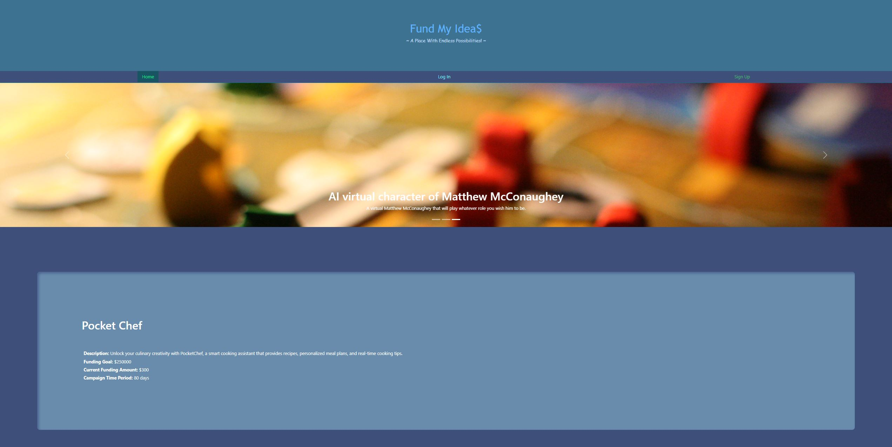

# Fund My Idea$

## Description

Our motivation to build this project was to learn how to collaborate in ordr to build a React application that utilized MongoDB and GraphQL.  We built this project because we wanted to become more experienced with utilizing GraphQL and Apollo Server to be able to build applications.  The project solves the problem of users needing a website to raise money for various projects.  The project is a crowdfunding application that allows users to create projects, back them with fake money, and also leave comments on projects.  For this project, we learned how to troubleshoot various errors that appeared with GraphQL and Apollo Server.  We also learned how to work under pressure and not give up when the task at hand seemed quite large.  

## Table of Contents (Optional)

This README isn't that long, so N/A.

## Installation

N/A

## Usage

This application has been deployed to Heroku.  To access it, please use the following link: [https://aqueous-spire-63150-6f0099dc1dae.herokuapp.com/projects/65cad9882f5d9a5eb94ec616](https://aqueous-spire-63150-6f0099dc1dae.herokuapp.com/projects/65cad9882f5d9a5eb94ec616)

Here is a screenshot of the application.  I zoomed out to get enough of it to fit on the page:

When you open the application, you will see a list of the projects that are currently on the website.  To create and back projects and leave comments, you will need to log in. If you don't already have an account, click the **Sign Up** button in the menu bar.  There, you can enter a username, email address, and password.  Keep in mind that you will need to enter a username and email address that is unique and a password that is at least eight characters long. Click **Submit** to complete the signup process.  If you do have an account, click the **Log In** button in the menu bar.  Then, you can enter your email address and password, and click **Submit** to log in.  

Once you are logged in, click on a project.  From there, you will be able to view the comments associated with it.  You can then click the button below the project to leave a comment on that project.  After you have clicked the button to leave a comment, type your comment into the input box and click **Submit Comment**.  The new comment will appear on the page. If you wrote a comment and are also logged in, you can click the **Remove Comment** button near any comment that you wrote to remove it.

If you wish to back a project, click the **Back this Project** button.  This will open an input box that allows you to enter an amount of money.  Then, click the Proceed to Checkout button.  This will oepn a Stripe checkout page that will allow you to enter your credit card information.  Because this application is in Stripe test mode and doesn't actually use real money, you can enter a Stripe test card number, which is **4242 4242 4242 4242**.  Enter in a valid future month and year for the expiration date, and any three-digit number for the security code.  Next, enter a country or region of the United States, and a zip code, and click the **Pay** button.  Because you used a valid test card, you should always see this payment go through.  You will then be redirected to a Success page that tells you your payment just went through, the name of the project you just funded, and how much money is needed finish funding the project.  The application will then redirect you to the Home page.  On the home page, you can then view the project you contributed to and see that the amount of funding it has has risen by the amount you contributed.

You can also click the **My Projects** button in the navigation bar to open a list of the projects that you have created.  From there, you can click the **Delete This Project** button associated with a project to delete it.  You can also click the **Create a Project** button to create a new project. When creating a new project, enter the project's name, description, funding goal and amount of days it will be active.  Then, clck **Add this Project**.  The new project will appear on the page below the existing projects.

If you wish to log out of the application, click **Log Out** in the navigation bar.  This will log you out of the application and return you to the home page.

## Credits

I, [Gabriel Morrow](https://github.com/theboss1485), worked with [Villy Yeoh](https://github.com/KaarageOnigiri) and [Chia Chi Yang](https://github.com/Cyang0590) to build this application.  Please feel free to visit our respective GitHub profiles by clicking on our names.

We used a bootstrap tutorial to create the image carousel.  This tutorial can be found here: [https://react-bootstrap.netlify.app/docs/components/carousel/](https://react-bootstrap.netlify.app/docs/components/carousel/)

We used the Xpert Learning Assistant AI chatbot to help out with writing the code.

We also reused code from the course activities and from previous challenge assignments in order to complete this project.

## License

This project is under an MIT license.   Please see the license in the GitHub repository for more information.

## Badges

We don't have any noteworthy badges to display.

## Features

This project is a crowdfunding application that allows users to create their own accounts, log in, create projects, and back those projects with fake money using the Stripe checkout process.  The application also allows users to delte their projects and leave comments on projects.  Users can delete the comments they have created as well.

## How to Contribute

This is a group project we completed for the OSU Fullstack Flex Web Development Bootcamp, so N/A.

## Tests

N/A